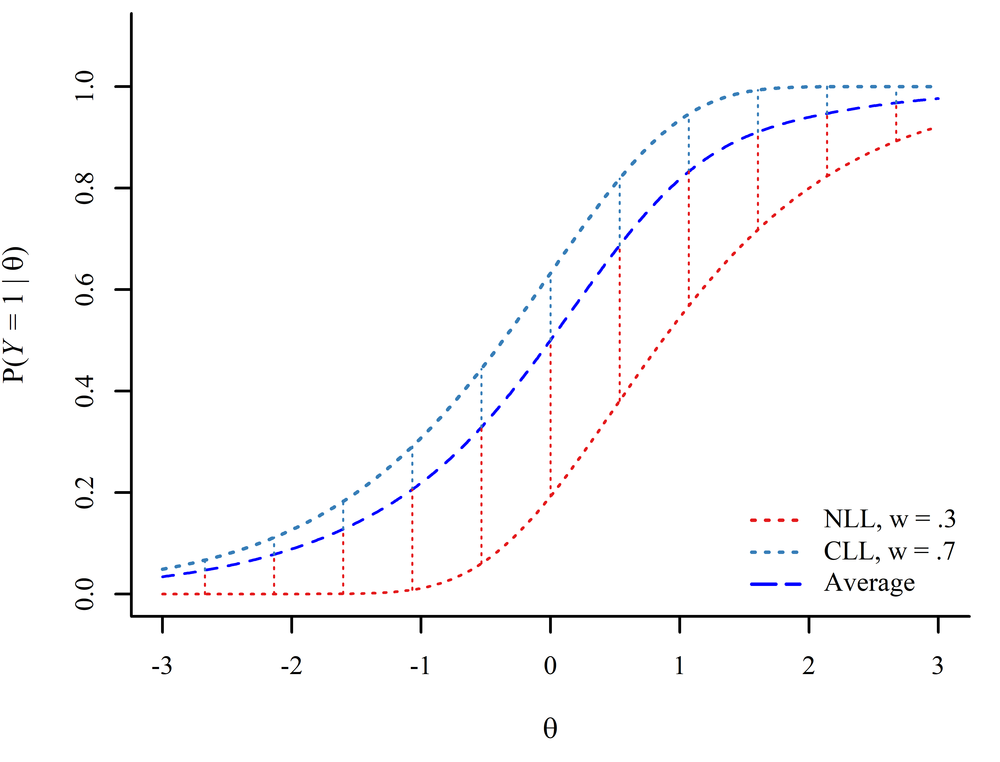

## Original Quarto Reveal Demo

Original demo for a Quarto Reveal presentation: [https://quarto.org/docs/presentations/revealjs/demo/#/title-slide](https://quarto.org/docs/presentations/revealjs/demo/#/title-slide){target="blank"}

</br>

The current theme adds some useful features. Most of the custom JS was implemented with some help from 
[ChatGPT](https://chatgpt.com){target="blank"} and my good friend [Paul Hazelton](https://www.linkedin.com/in/paul-hazelton/){target="blank"} (I am no web developer 🤷)

</br>

I also plan on adding more and more features as the need presents itself! Or, if you have any suggestions/feature requests, let me know here: [https://github.com/quinix45/Fabio_Theme/issues](https://github.com/quinix45/Fabio_Theme/issues){target="blank"}


## Changing the Theme Color

The minimalist style of the theme is intended to accommodate multiple theme colors. The theme color can be easily modified:

:::{layout-ncol="2"}

:::col

<center>

Open the **Fabio_theme.scss** file.

&#8595;

Find and edit the value of the **$theme-color:** variable with the desired theme color. Save. 

&#8595;

Render .qmd file. 

</center>


**Note:** other global variables such as font and font size can also be changed in the same way.

:::

:::col

<center>

A video of how to change the theme color can be found at the following link:

</br>

[https://youtu.be/_gTuedSeh5o](https://youtu.be/_gTuedSeh5o){target="blank"}

</center>

:::
:::

Many Slides elements adjust dynamically to the theme color.

## Zoomable Images  

Tired of hearing that your figures are too small to read?? Custom JS zoom options for figures on **left-click**! To reset to original position, **right-click** on image.


:::{layout-ncol="2"}

:::col
<div>
{width="20%"}     
</div>
:::


:::col

**Note:** Using .absolute to position images will interfere with the zoom feature. If zoom function is needed for an absolutely positioned images, I recommend creating an absolutely position div and place the image inside it like so:

</br>

```html
<div style="position: absolute; top:60%; left:50%;">
{width="30%"}
</div>
```

:::

:::

{width="20%"} 

<!-- to absolutely set images without interfering with zoom option -->

<div style="position: absolute; top:70%; left:50%;">
{width="30%"}
</div>

## GGplot Output

Zoom also works with `GGplot` output 

```{r echo=TRUE}
#some random comment to see if chunk resizes correctly
par(mar = c(4, 4, 1, 1)) 
plot(pressure)
```


## Animations On/Off

The the also includes custom .js code that allows to turn animation on and off when the "t" key is pressed

::: {.fragment fragment-index=1}
- press "t"
:::


::: {.fragment fragment-index=2}
- Animations can then be played as one normally would by using the arrow keys
:::


::: {.fragment fragment-index=3}
- animations are off by default. I turn them on when presenting!
:::


## Accessibility and Quality of Life Improvements

The them also adds 4 icons at the bottom left:


- The magnifying lens toggles a search box on the top right that can be used to search throughout the slides. This functionality is available in base reveal.js, but the shortcut is not very intuitive and not explicitly stated to users. I also added a search button that can be pressed to initiate the search (instead of pressing "enter" or "return" being the only way of initiating the search)

- the two arrows can be clicked to navigate back and forth (I do not like the reveal.js default that creates two huge arrows when navigation commands are shown). I add navigation arrows by default in the theme because I found that some users do not immediately realize that arrow keys can be used to navigate slides. 

- The full screen button makes it intuitive that a full screen option exists. In my experience, a good deal of users do not know about pressing "F11" in browsers to get full screen.


- Added some \@media properties that improve the viewing experience of the slides on screens of varying sizes (e.g., phones, tablets). However, a computer browser is still recommended. 


# If I think of Some Other Useful Features, I will Add them 👋


